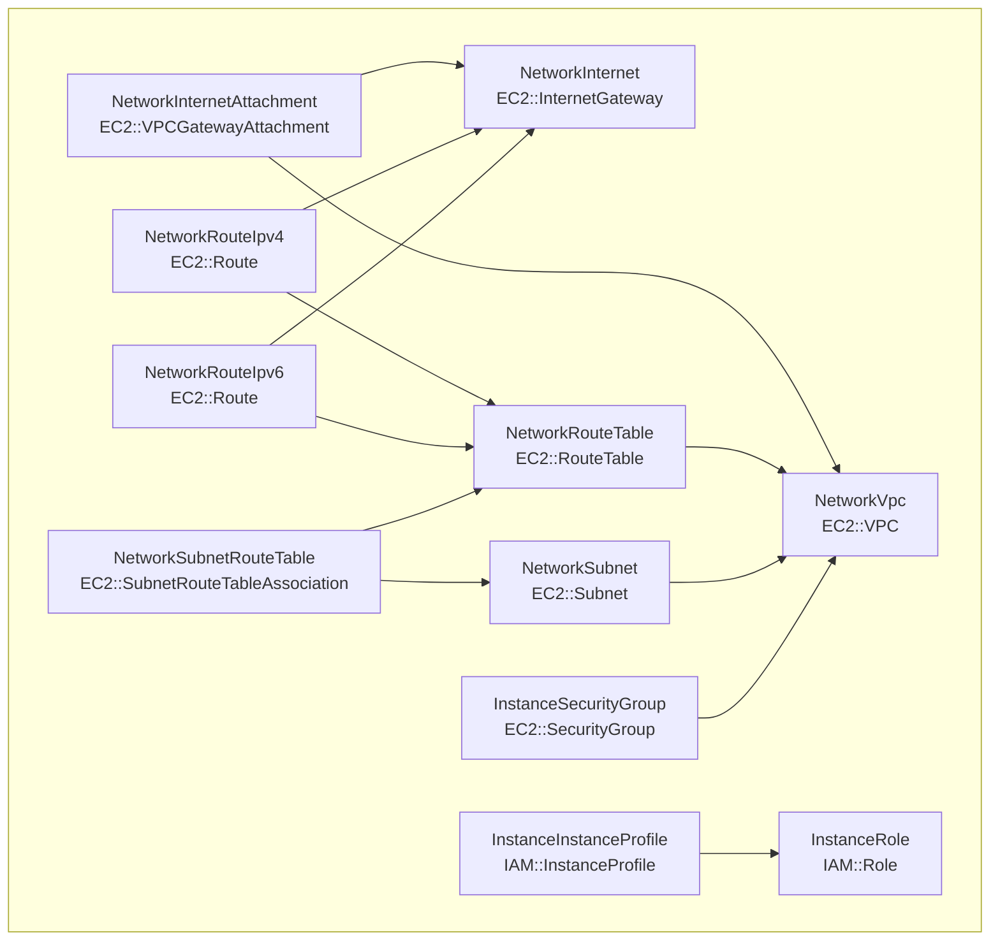

```mermaid
	flowchart TB;
		subgraph &nbsp;
		rootNetworkInternetAttachment[NetworkInternetAttachment<br/>EC2::VPCGatewayAttachment]-->rootNetworkInternet[NetworkInternet<br/>EC2::InternetGateway]
		rootNetworkInternetAttachment[NetworkInternetAttachment<br/>EC2::VPCGatewayAttachment]-->rootNetworkVpc[NetworkVpc<br/>EC2::VPC]
		rootNetworkRouteTable[NetworkRouteTable<br/>EC2::RouteTable]-->rootNetworkVpc[NetworkVpc<br/>EC2::VPC]
		rootNetworkRouteIpv4[NetworkRouteIpv4<br/>EC2::Route]-->rootNetworkInternet[NetworkInternet<br/>EC2::InternetGateway]
		rootNetworkRouteIpv4[NetworkRouteIpv4<br/>EC2::Route]-->rootNetworkRouteTable[NetworkRouteTable<br/>EC2::RouteTable]
		rootNetworkRouteIpv6[NetworkRouteIpv6<br/>EC2::Route]-->rootNetworkInternet[NetworkInternet<br/>EC2::InternetGateway]
		rootNetworkRouteIpv6[NetworkRouteIpv6<br/>EC2::Route]-->rootNetworkRouteTable[NetworkRouteTable<br/>EC2::RouteTable]
		rootNetworkSubnet[NetworkSubnet<br/>EC2::Subnet]-->rootNetworkVpc[NetworkVpc<br/>EC2::VPC]
		rootNetworkSubnetRouteTable[NetworkSubnetRouteTable<br/>EC2::SubnetRouteTableAssociation]-->rootNetworkRouteTable[NetworkRouteTable<br/>EC2::RouteTable]
		rootNetworkSubnetRouteTable[NetworkSubnetRouteTable<br/>EC2::SubnetRouteTableAssociation]-->rootNetworkSubnet[NetworkSubnet<br/>EC2::Subnet]
		rootInstanceInstanceProfile[InstanceInstanceProfile<br/>IAM::InstanceProfile]-->rootInstanceRole[InstanceRole<br/>IAM::Role]
		rootInstanceSecurityGroup[InstanceSecurityGroup<br/>EC2::SecurityGroup]-->rootNetworkVpc[NetworkVpc<br/>EC2::VPC]

  	end

```
