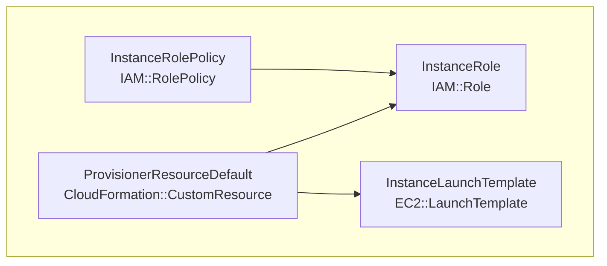

```mermaid
	flowchart TB;
		subgraph &nbsp;
		rootInstanceRolePolicy[InstanceRolePolicy<br/>IAM::RolePolicy]-->rootInstanceRole[InstanceRole<br/>IAM::Role]
		rootProvisionerResourceDefault[ProvisionerResourceDefault<br/>CloudFormation::CustomResource]-->rootInstanceLaunchTemplate[InstanceLaunchTemplate<br/>EC2::LaunchTemplate]
		rootProvisionerResourceDefault[ProvisionerResourceDefault<br/>CloudFormation::CustomResource]-->rootInstanceRole[InstanceRole<br/>IAM::Role]

  	end

```
